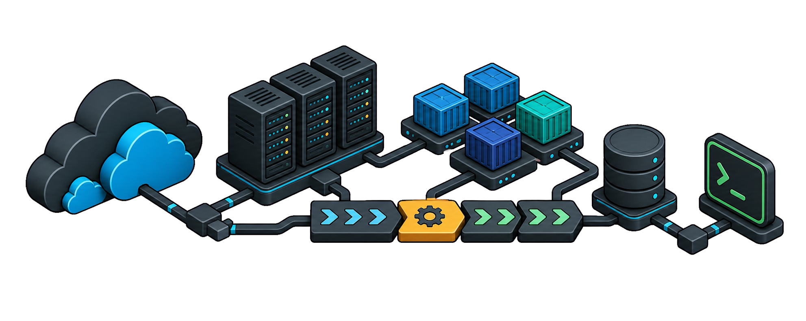
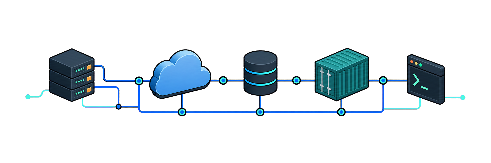

<h1>Idan Botbol</h1>
<h3>DevOps & Software Engineer</h3>

Building reliable cloud infrastructure, delivery automation, and backend systems.

## Core stack

### Platform & delivery

  
  
  
  
  

### Backend & services

  
  
  
  
  

<strong>More tools &amp; technologies</strong>

 

<strong>Delivery &amp; operations</strong>

  
  
  
  
  
  

<strong>Data &amp; messaging</strong>

  
  
  
  
  
  

## On rotation

  
  

  
  

